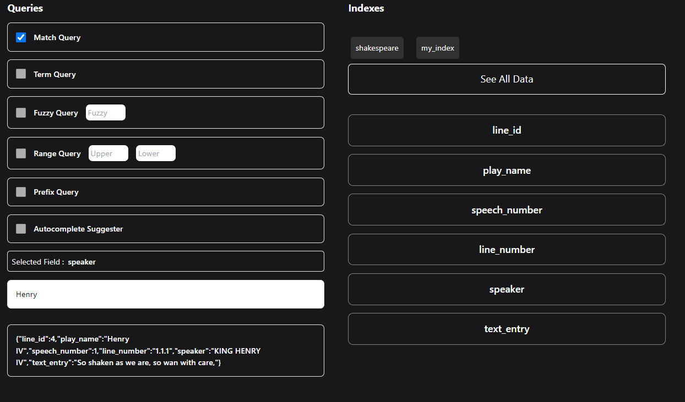

# Elastic Search Attempts With Nest.js

- This is an MVC application in NestJS that executes Elasticsearch queries and allows testing from the front-end. It provides an environment for experimenting with Elasticsearch queries in a NestJS-based MVC application.



## Technologies

### On Backend

---

- Nest.js
- Typescript
- Elastic Search

### On Frontend

---

- Handlebars

## Prerequisites

- Docker
- Node

---

## Running Application

## Docker Run

The application can be built and run by the `Docker` engine. The `Dockerfile` has multistage build, so you do not need to build and run separately.

Please follow the below directions in order to build and run the application with Docker Compose;

```sh
$ docker-compose up -d
```

<b>OR</b>

```sh
$ ./build.sh
```

Docker compose creates 3 replicas (instances) of the application.

### Application

#### You can reach application via `http://{PORT}`

### Elastic Search

#### You can reach ElasticSearch page via `http://{HOST}:9200`

### Kibana

#### You can reach Kibana page via `http://{HOST}:5601`
